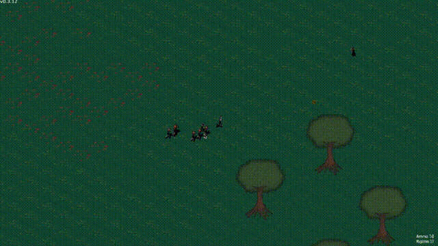

# Hinterland

[](https://travis-ci.org/Laastine/hinterland)
[](https://ci.appveyor.com/project/Laastine/hinterland)

Isometric shooter game written in Rust. Shoot zombies, collect ammo and survive.<br> Works on Linux, macOS and Windows.<br/>
Download precompiled binary from [Github releases](https://github.com/Laastine/hinterland/releases) page.

## Preview



## Build & Run

`cargo run -- --windowed_mode`


## Command line arguments

```
USAGE:
    hinterland [FLAGS]

FLAGS:
    -h, --help             Prints help information
    -v, --version          Prints version information
    -w, --windowed_mode    Run game in windowed mode
```

## Controls

`w,a,s,d` - Character move<br/>
`Ctrl + Mouse left` - Fire<br/>
`r` - Reload weapon (10 bullets per mag)<br/>
`z` - zoom in<br/>
`x` - zoom out<br/>
`Esc` - exit

## Development

Run windowed mode with `cargo run --features "godmode framerate -- -w`

`cargo test` - run unit tests

## External asset licence list

* Character: [graphics](http://opengameart.org/content/tmim-heroine-bleeds-game-art) Creative Commons V3
* Zombie [zombie](http://opengameart.org/content/zombie-sprites) Creative Commons V3
* Audio: [pistol](http://opengameart.org/content/chaingun-pistol-rifle-shotgun-shots) Creative Commons V3
* Map: [graphics](http://opengameart.org/content/tiled-terrains) GPL + Creative Commons V3

## Source code license

[Apache License 2.0](https://github.com/Laastine/hinterland/blob/master/LICENSE)
