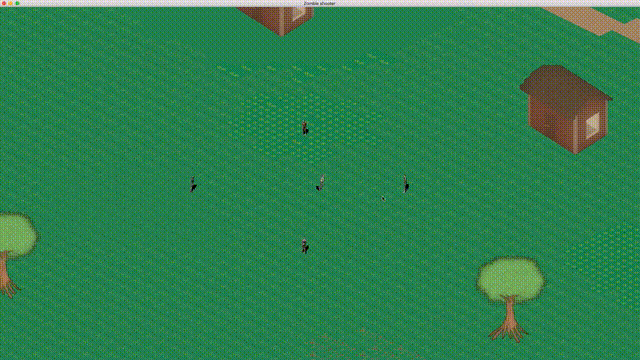

# Hinterland

[](https://travis-ci.org/Laastine/hinterland)

Isometric zombie survival game written in Rust.
Project started as SDL2, but was later converted to use gfx-rs.



## Project overview
- [Blog post](https://laastine.kapsi.fi/code/2018/01/07/zombie-shooter.html)
- [Project's task board](https://github.com/Laastine/hinterland/projects/1)

## Build

```bash
cargo install
cargo run
```

## Controls

`W,A,S,D` - Character move<br/>
`Mouse left` - Fire<br/>
`Z` - zoom in<br/>
`X` - zoom out<br/>
`Esc` - exit

## Development

Run windowed mode with `cargo run --features windowed`

Tested with Rust 1.25.0 with macOS and Linux. Windows not supported, but it _should_ work OK too.<br/>
For some reason game is not working with Intel based GPUs.

## External asset licence list

* Character: [graphics](http://opengameart.org/content/tmim-heroine-bleeds-game-art) Creative Commons V3
* Zombie [zombie](http://opengameart.org/content/zombie-sprites) Creative Commons V3
* Audio: [pistol](http://opengameart.org/content/chaingun-pistol-rifle-shotgun-shots) Creative Commons V3
* Map: [graphics](http://opengameart.org/content/tiled-terrains) GPL + Creative Commons V3
